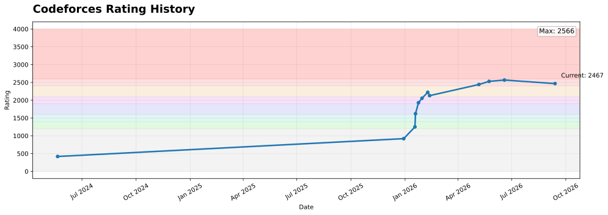
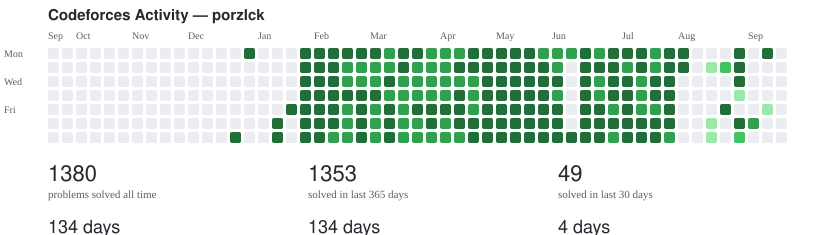
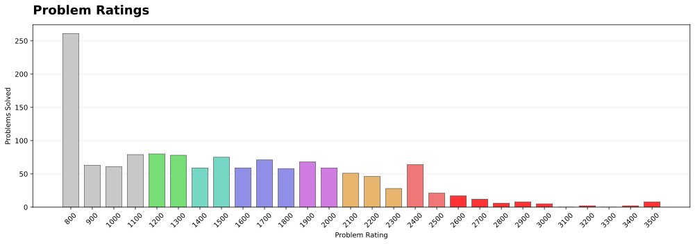
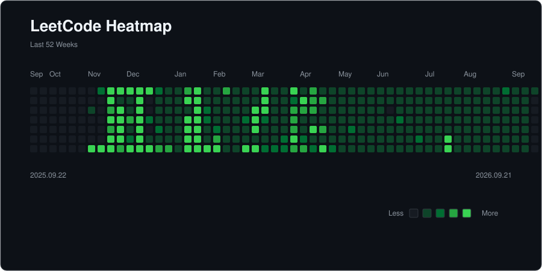
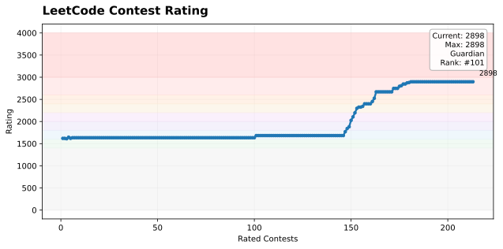

# Hi, I'm porzlck 👋

---

## 👨‍💻 About Me

- 🎓 Mathematics undergraduate
- 🤖 Exploring **Machine Learning & Deep Learning**
- 🧠 Interested in **Algorithms, Competitive Programming, and AI**

---

## 🏆 Codeforces

  
  
  

---

## 🧩 LeetCode

  
  

---

## 🛠 Tech Stack

---

### ⭐ Thanks for visiting!

